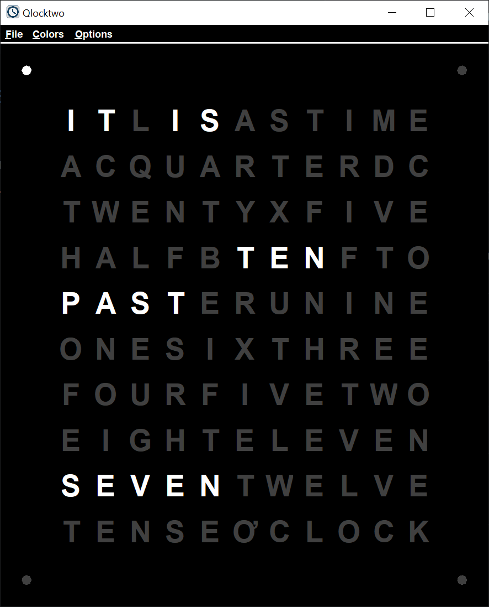
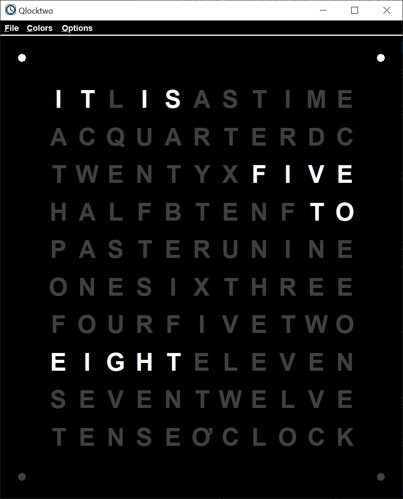

# Qlocktwo

## Introduction

I came across an interesting clock, the [Qlocktwo](https://www.thegivingtreegallery.com/home-decor/shop-by-designer/qlocktwo/?utm_source=bing&utm_medium=cpc&utm_campaign=%5BSB%5D%20Tier%20B%3A%20Product%20-%20US&utm_term=biegert%20%26%20funk%20qlocktwo&utm_content=Biegert%20%26%20Funk%20QLOCKTWO%20%7C%20created-11.08.2018), designed by Biegert & Funk. The clock is an electronic piece of art. Different letters light up at different times to tell the time in words.

Now, there’s no reason to build a computer version of the Qlocktwo. With a computer program, you could display just the necessary words. Or numbers. Or even simulate a mechanical clock.

So, I went ahead and built my own version of the Qlocktwo using Java Swing. Here’s an image of it.

Here's a second image, taken later.

I rearranged the letters in the 3rd row, but otherwise, I copied the letters from the Qlocktwo. I snapped the first screen shot at 7:11 in the morning and the second at 7:57. The four dots on the outside corners represent minutes. The words change every five minutes.

I’ve not seen a Qlocktwo in operation. I’ve seen a few pictures. I had to guess which letters lit to represent different times. I hope I guessed well.

There were some aspects to this project that were interesting. Creating the main JPanel required a couple of tricks. Coloring the JMenuBar required some trial and error.

I used Java 8 and Windows 10 to code the Java Swing application.

I used the [model / view / controller](https://en.wikipedia.org/wiki/Model%E2%80%93view%E2%80%93controller) pattern (MVC) to create this Java Swing clock. When constructing a GUI, the MVC pattern allows you to separate the concerns and focus on one part of the application at a time. This application required 3 model classes, 6 view classes, and a number of controller classes. All but one of the controller classes were coded as anonymous classes or inner classes. I’ll explain why as we go through the class explanations.

Like the physical Qlocktwo, there are several color schemes that are available for the Java Swing Qlocktwo. You choose a color scheme from the JMenuBar, and the rest of the Swing application gets the color information from the ColorScheme instance. You can add additional color schemes if you wish. My favorite is the black scheme, although the pink scheme works surprisingly well.

## Model

Each instance of the QlocktwoCharacter class holds one of the Qlocktwo letters. The reason that I didn’t just use a char array is that I need to know when the letter was off and when the letter was on. Rather than trying to coordinate a separate char array and a boolean array, I created the QlocktwoCharacter class, and kept a QlocktwoCharacter array.

Data classes like QlocktwoCharacter are useful for organizing data into structures.

The QlocktwoModel class is the main model class for the GUI. I have a char[][] array for the characters, and some other fields that help determine the status of the clock.

I copied the char[][] array into the Qlocktwo[][] array. I changed one of the O characters on the last row to &#x01A0 for &#x01A0 clock.

I came up with a clever scheme for defining the words I wanted to display. As far as I could tell, all the words were in the rows. There were no words that were in a column. So, I came up with a way to specify the word I wanted by listing the row and the columns that made up a word. You can see that starting with the setItIs method. The setCharacters method took those numbers and used them as array indices to turn on the characters in the QlocktwoCharacter array.

## View

Notice how we use a JFrame in the QlocktwoFrame class. We don’t extend Swing components unless we want to override a component method. We don’t extend any Java class unless we want to override a class method. I’ll never understand why Swing teachers teach students to extend the Swing components. Using a Swing component keeps your methods separate from the Swing component’s methods.

The createPartControl method is pretty much the same for every Swing application I code. The WindowListener listens for the main window (JFrame) closing, so I can stop the clock runnable. After I create the view, I start the clock runnable. Generally, this is how you code a Swing application. First, you define all of the Swing components and build the view. Then you start any other threads that update the view.

There are 3 convenience methods at the bottom of the class. These methods allow me to update the inner panels from the QlocktwoFrame class. This way, I only have to pass an instance of the QlocktwoFrame class to the controller. The controller doesn’t need to know about the view inner classes.

We use a PNG image as an icon for the JFrame. You can use any JPEG or PNG image as an icon.

The simpler the image, the better. The image will be shrunk to 48 x 48 pixels on Windows 10.

I loaded the image using the getFrameImage method. I created an images folder under the project name. I put the images folder on the class path. That way, I can read the image in Eclipse and I can read the image when I pack it in a JAR file.

Finally, this is how I implement the model / view / controller pattern (MVC) in Java Swing.

1. The view may read values from the model. The view may not change values in the model.
2. The controller will (probably) change values in the model.
3. The controller will (probably) cause the view to repaint.

I don’t have one master controller, usually. I let each controller do its thing.

The QlocktwoPanel JPanel is made up of 9 subordinate JPanels, arranged in a 3 x 3 grid. The JPanels that make up the grid are different sizes.

I used the GridBagLayout to lay out the 9 subordinate JPanels. There are 4 dot panels, one in each corner. There are 4 dummy panels to fill out the main JPanel. There’s a character panel in the middle that displays the clock letters. I’ll describe these subordinate JPanels later in more detail.

I wrote the addComponent method to make sure each Swing component gets it’s own GridBagConstraints. Even though you can share one GridBagConstraints between Swing components, I don’t like to. I don’t want to remember the defaults and which elements to change for each Swing component. It’s much easier and less error-prone to create a complete GridBagConstraints for each Swing component.

I specified a fill of GridBagConstraints.BOTH for all of the subordinate JPanels so they would stretch when the JFrame is maximized.

We extend a JPanel creating the DotPanel class because we want to override the getPreferredSize and paintComponent methods.

Basically, we paint a circle in the middle of the JPanel. We choose the color for the circle depending on whether it’s off or on. See how we get the colors from the ColorScheme instance.

The paintCircle method is a convenience method that allows us to define the circle with a radius and center point. Feel free to copy this method. I did, sometime long ago.

All the DummyPanel class does is paint the dummy panel with the current background color. This fills in the space around the dot panels and the character panel.

The CharacterPanel class creates a JLabel[][] array to hold the clock letters. One clock letter for each JLabel. We keep the instances of JLabel because we want to be able to turn the letters on and off by painting the letters a different color. Finally, we need to repaint the JLabel border when the color scheme changes.

I use a basic sans serif font that comes with Java. This font should be available on most, if not all, systems that have Java. 36 point worked out to a JFrame of 617 × 740 pixels, which should fit on most desktop monitors.

Notice how we separate the definition of the JLabels from the updating of the JLabels. Again, you first define the Swing components, then you use the Swing components. Don’t try to define and use the Swing components at the same time. You’re only asking for heartache. Separate your concerns as much as possible.

The createPartControl method of the QlocktwoMenuBar class builds the JMenuBar, the JMenus, and the JMenuItems in a standard way. I give all the JMenuBar components a mnemonic key to facilitate using the keyboard instead of the mouse. The ALT key is assumed.

I use anonymous controller classes because they are small. It wasn’t worth the effort to make them separate controller classes. I created the ColorActionListener as an inner class because one of the methods it performs is to repaint the JMenuBar itself. You can make the ColorActionListener its own class if you want.

## Controller

If you look back to the QlocktwoFrame class, I run this class in a separate thread. The ClockRunnable class has the same change model, update GUI, and sleep loop you would find in any animation class.

The test mode runs in minutes and seconds instead of hours and minutes. This allows me and you to cycle the clock through a 12 hour period in 12 minutes. I used this mode to test the clock. You can use this mode to show the clock off to your friends.

We sleep for a period of time, depending on whether we’re running in test mode or normal mode. I wake up the thread 6 times a second or 6 times a minute, depending on the mode. This keeps the clock more closely synchronized to the computer time. Even at 6 times a second, the thread doesn’t use much CPU time.

In the setModelTime method, there are two long (too long?) switch statements. I couldn’t think of a better way to turn the clock words on.

Since we’re running this class in a separate thread, we update the GUI by putting the methods in the SwingUtilities invokeLater method. This ensures that the GUI update happens on the Event Dispatch thread (EDT).
